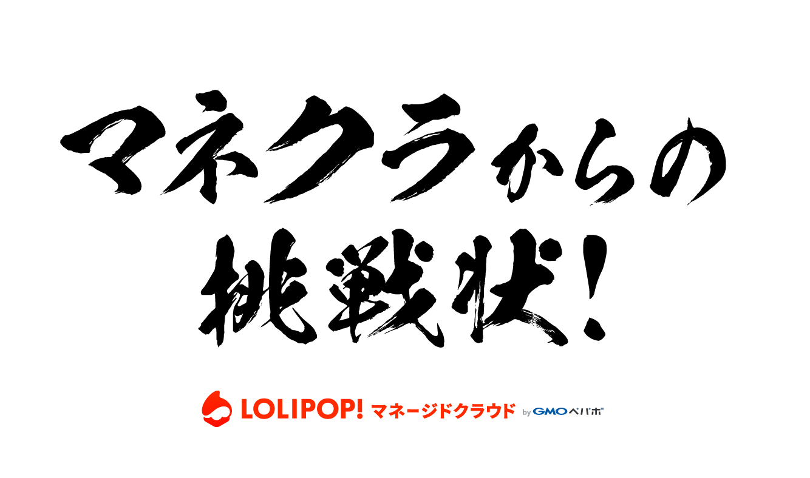

# PHPアプリケーション脆弱性修正チャレンジ

- https://security-challenge.lolipop.io/

# 必要なもの

- PHP 7.3.2 (PHP7以上であれば問題ないと思います)
- make
- ssh

# レギュレーション

- PHP で作成された脆弱なアプリケーション5つのソースコード(このリポジトリ)をお渡しします
- 脆弱性を修正し、正常系のテスト(phpunit)が通ることを確認してあなたのプロジェクトにデプロイしてください
- デプロイしたプロジェクト URL を https://security-challenge.lolipop.io/ にて該当の問題のフォームに入力してください
- 「OK!」が出るとチャレンジクリアです。それ以外の場合はまだ修正不備があります。
- コンテナ内の /var/www/html 内にWebサイトを表示するのに必要な全てのコード、およびファイルを設置してください
- ソースコードや Makefile で「変更しないでください」等の記述がある箇所は変更しないでください
- phpunit のテストは変更しないでください

# はじめかた

各問題の README をお読みください

# チャレンジクリアの条件

- phpunit が通っている
- https://security-challenge.lolipop.io/ での検査にて「OK!」との結果が出ている

上記を運営にお見せください。

# ヒント

- 問題タイトルがヒントになっているものもあります
- `make ssh` でマネクラの SSH コンテナにアクセスできます
- [アプリケーションのログやアクセスログの確認方法](アプリケーションのログやアクセスログの確認方法)
